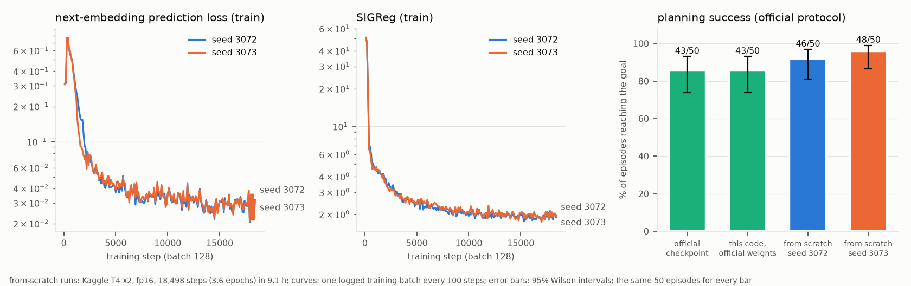
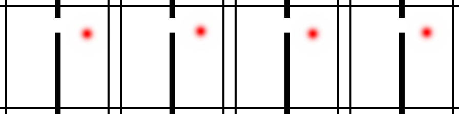

# lewm-t4

**LeWorldModel, reimplemented in plain PyTorch, matching the official model to float precision on its own weights, and retrained from scratch on free Kaggle T4s to planning success on par with the released model's (92% and 96% against 86%; not a significant difference on 50 episodes).**

[](https://github.com/gandhiashutosh14/lewm-t4/actions/workflows/ci.yml)

-blue)


> **In plain English:** LeWorldModel (Maes, Le Lidec, Scieur, LeCun and Balestriero, 2026) is a
> JEPA world model: it learns to predict the *internal representation* of the next camera frame,
> not the pixels, and plans by searching for actions whose imagined future lands on a goal. It
> trains with only two loss terms, thanks to SIGReg from LeJEPA. This repository reimplements it
> as one readable PyTorch file, from the paper and the authors' released code and configs, and
> checks the result three ways. Loaded with the authors' released weights, it produces the same
> numbers as their model to float precision. Inside the authors' own planning evaluation, it
> succeeds and fails on exactly the same episodes as their model. Trained from scratch for nine
> hours on Kaggle's free T4 GPUs, two seeds reach 92% and 96% planning success against 86% for the
> released model on the same 50 episodes. That is a match, not a win: on 50 episodes the
> differences are not statistically significant (paired exact McNemar p = 0.38 and 0.06).

**Reading guide:** [results](#results) first; [how it works](#how-it-works) is the model in one
screen; [verify it yourself](#verify-it-yourself) is an install and two commands.

## Results



| Check | Evidence | Result |
|---|---|---|
| Architecture | [`lewm_t4/model.py`](lewm_t4/model.py): ViT-tiny encoder, BatchNorm projectors, action embedder, 6-layer AdaLN-zero causal predictor, SIGReg | 18,034,478 parameters, the official count |
| Load the official TwoRoom checkpoint | [`lewm_t4/convert.py`](lewm_t4/convert.py) maps it onto this code, and back | the round trip is exact |
| Numerical parity, CPU | the same seeded inputs through both models; measured values in [`reports/parity-cpu.json`](reports/parity-cpu.json), re-measured and printed by [CI](.github/workflows/ci.yml) on every push against the checkpoint downloaded fresh; the CI tests fail if encodings or predictions differ by more than 1e-5 (plus 1e-5 relative), or planning costs by more than 1e-5 relative | encoder **bit-exact**; action encoder and predictor within 1e-6; planning cost within 2e-7 relative |
| Numerical parity, GPU | Kaggle T4, fp32 ([`reports/kaggle-verify.json`](reports/kaggle-verify.json)) | encoder bit-exact; predictor within 5e-7 |
| Parity inside the official planning loop | the authors' 50-episode TwoRoom protocol and CEM solver, once with their model and once with this code carrying their weights | **43/50 (86%) for both, with identical outcomes on every episode** |
| Train from scratch | [`kaggle/train`](kaggle/train): two models trained at once, one per T4, fp16, batch 128, the published optimiser and loss; 18,498 steps (3.6 epochs) in 9.1 hours ([`reports/kaggle-train.json`](reports/kaggle-train.json)) | final validation prediction loss 0.020 and 0.018; SIGReg 2.2 |
| Plan with the models trained from scratch | the same protocol, solver seed and 50 start/goal pairs (by construction: same code, seed and dataset); the released model's 43/50 was measured in the verification run | **46/50 (92%) and 48/50 (96%)** |
| Exported weights | `to_official` output loaded with `strict=True` into the reference model code | loads, and encodes exactly as this code does (checked locally on both trained checkpoints; not part of CI) |

**How to read the planning numbers.** Paired by episode against the released model, seed 3072
solves 4 episodes that the released model fails and fails 1 that it solves (exact McNemar
p = 0.38); seed 3073 solves 5 it fails and fails none it solves (p = 0.06). The 95% Wilson
intervals are 74-93% for the released model and 81-97% and 87-99% for the two runs. So training
from scratch on free GPUs **reproduces** the released model's planning success; it does not show it
exceeds it. Both runs fail episodes 17 and 31 (0-based positions in the evaluation list), which the
released model fails too.

**How independent the two runs are.** They differ in weight initialisation and in the random
SIGReg projection directions. They share the data split, the batch order and, very likely, the
dropout masks, because both read one data loader and both GPUs' generators were seeded the same
way. Their agreement therefore understates how much independent runs would vary.

**Compute.** The released training config (`config/train/lewm.yaml` in the authors' repository)
sets 100 epochs. This run had a 9-hour training budget inside Kaggle's 12-hour session and trained
two models at once, which fit 3.6 epochs each. Sharing batches saved little: a step took about
1.7 s with two models against about 0.9 s for one (0.88 s over steps 101-200 in the verification
kernel's log, a different session with an earlier version of the loop; the 1.03 s/step in
`kaggle-verify.json` also counts start-up and a validation pass), which suggests the two GPUs
largely took turns rather than working in parallel. The cause was not profiled; the likely one is
the fp16 gradient scaler, whose optimiser step reads its overflow check back to the CPU every step,
so the loop waits for one GPU before it launches the other's work. One model alone would have fit
about 7 epochs in the same budget.

**The learning-rate schedule.** The step budget is set from the measured step time, so the first
300 steps ran on a provisional 100-epoch schedule at a learning rate below 6e-7 (about 1% of the
peak); those steps still moved the model (training SIGReg fell from 51 to 20). The schedule was then
fitted to 18,498 steps with a 924-step warm-up (the learning rate jumped to about 1.6e-5) and a full
cosine decay to zero. This per-step schedule is this project's own: the released code steps its
warm-up and cosine schedule once per epoch.

**A validation curve that looked wrong.** Validation prediction loss, computed in eval mode, swung
between 2 and 42 through step 12,500 (two-thirds of training) while the training loss fell
smoothly. It dropped to about 1 at step 15,000 and settled at 0.020 and 0.018 by the end, in line
with the training prediction loss (0.02-0.04 per batch over the last 900 steps). The likely cause
is the BatchNorm layers in both projectors, which use running statistics in eval mode: validation
SIGReg, measured on embeddings where BatchNorm is the only layer that behaves differently in eval
mode, reached 80-294 while the training value (the logged batch at the same steps) was 1.9-3.3. Why the running statistics fitted so badly
while the learning rate was high was not tested. Only the final checkpoints were kept and planned
with, by design, and by then the eval-mode loss had settled. The validation windows are a random 10%
of overlapping windows from the same episodes, so they share frames with the training windows.

## The task



TwoRoom: a dot in two rooms joined by a door must reach a goal position, seen only as 224 x 224
pixels. The dataset has 10,000 episodes and 920,809 frames. The model sees the current frame and a goal
frame and plans five 5-frame action chunks ahead; an episode succeeds if the agent reaches the goal
within 50 steps. As in the authors' evaluation code, start and goal states are drawn from the
dataset's own trajectories (seed 42), 25 steps apart, so a goal need not be in the other room. Those trajectories are the training data for
every model compared here, the released one included, so the benchmark measures planning between
states seen in training, not generalisation to new ones.

## How it works

```
 frame t-2, t-1, t (224 x 224)      actions (5 frames x 2-D, z-scored)
        |                                   |
  ViT-tiny, patch 14 -> CLS (192)     Linear mix -> MLP (SiLU) -> 192
        |                                   |
  Linear -> BatchNorm -> GELU -> Linear     |
        |                                   |
     z_{t-2}, z_{t-1}, z_t  ---->  6 causal transformer blocks, each sub-layer shifted, scaled and
                                   gated by the action embedding (AdaLN-zero)  ->  BatchNorm MLP
                                                  |
                                   z_hat_{t+1}  (compared with the encoding of frame t+1)

 loss = MSE(z_hat, z) + 0.09 * SIGReg(z)          no EMA teacher, no stop-gradient, no decoder
 plan = CEM over 5 steps x 5 frames of actions, cost = ||z_hat_final - z_goal||^2
```

SIGReg draws 1,024 random directions, projects each time step's batch of embeddings onto them,
and measures (Epps-Pulley) how far each 1-D projection is from a standard normal. Pushing every
projection toward N(0, 1) pushes the whole embedding toward an isotropic Gaussian, which rules out
the collapsed solution where every frame maps to the same point.

## Verify it yourself

```bash
pip install torch torchvision --index-url https://download.pytorch.org/whl/cpu
pip install -e ".[reference,dev]"
pytest -q                        # 7 tests; downloads the official 72 MB checkpoint once
python scripts/parity_report.py  # the measured differences
```

The GPU runs are the two Kaggle kernels in [`kaggle/`](kaggle): `verify` (about 11 minutes, one GPU
of a T4 x2 session) and `train` (about 9.2 hours on T4 x2). Each clones this repository at a pinned
commit (set when the kernel is pushed) and records it as `repo_sha` in its output: `e7d9556` for the
verification, `bd94e7d` for training. The outputs are committed in [`reports/`](reports). The
trained weights are not redistributed here; `kaggle/train` retrains comparable models (the number
of steps depends on the measured step time, and fp16 GPU training is not bit-reproducible).

## A note for anyone loading the official checkpoint

The released weights use the parameter names of Hugging Face `transformers` 4.x (inside the ViT:
`encoder.layer.N.attention.attention.query`). Recent `transformers` 5 releases (5.9 onward) renamed
the ViT modules (`layers.N.attention.q_proj`, without the `encoder` level), so the checkpoint no
longer loads into a current `ViTModel`. Pin `transformers<5` as this repository does, or use
`lewm_t4.convert.from_official`, which reads the checkpoint's own names.

## What this does not claim

- It is a reimplementation and reproduction, not a new method. Credit for LeWorldModel belongs to
  its authors; the implementation follows their paper and their released code and configs, with
  this project's own module structure. See [`NOTICE.md`](NOTICE.md).
- Parity and retraining are shown for TwoRoom only. The other environments use the same
  architecture but were not run.
- Training differs from the published setup in precision (fp16 on a T4, not bf16), length (3.6 of
  the configured 100 epochs) and learning-rate schedule (a per-step warm-up and cosine decay fitted
  to the time budget after 300 steps at a learning rate below 6e-7; the released code steps its
  schedule once per epoch).
- 50 evaluation episodes and two training runs that share their data order: enough to show the
  reproduction works, not to rank it against the released model.
- The benchmark plans between states from the training data (for every model compared); it does
  not test generalisation to new states.

## SWOT analysis

| | Helpful | Harmful |
|---|---|---|
| **Internal** | **Strengths:** parity is shown numerically and behaviourally, and CI re-measures it against the authors' checkpoint on every push; the whole reproduction (verification and training) ran on free hardware and re-runs from two scripts; the write-up was checked claim by claim against the raw logs before publishing. | **Weaknesses:** one environment; two runs that share their data order; a short schedule; the planning comparison uses the authors' own evaluation package, so a bug shared by both sides would not show up there (the numerical parity tests do not depend on it); sharing batches between two GPUs gave little speed-up. |
| **External** | **Opportunities:** the one-file model is easy to modify, so JEPA variants (another regulariser, a smaller latent, noisy observations) can be tested against a verified baseline; the converter lets models trained here be used with the authors' tooling. | **Threats:** the reference package and `transformers` both change quickly (the ViT parameter rename already broke checkpoint loading); free-GPU quotas and session limits can change. |

## Where this applies

- **Adopting a new model family:** before building on a paper, confirm an independent
  implementation matches the original on its own weights and in its own benchmark.
- **World models for planning** in robotics, games and operations, where a compact latent is
  searched for actions instead of generating pixels.
- **Cheap research infrastructure:** a verified baseline that trains in one free GPU session.

## Glossary

| Term | Meaning |
|---|---|
| World model | A learned model that predicts how the world changes after an action, used to imagine outcomes before acting. |
| JEPA | Joint-Embedding Predictive Architecture: predict the embedding of the future, not its pixels. |
| SIGReg | Sketched Isotropic Gaussian Regularisation, from LeJEPA: keeps embeddings spread out like a standard normal so they cannot collapse. |
| AdaLN-zero | Conditioning a transformer by letting the condition (here, the action) shift, scale and gate each layer, with gates starting at zero. |
| CEM | Cross-entropy method: sample action plans, keep the best, resample around them, repeat. |
| Parity | Two implementations producing the same outputs from the same weights and inputs. |
| McNemar test | A paired test for two classifiers on the same cases, using only the cases where they disagree. |
| Wilson interval | A confidence interval for a success rate that behaves well near 0% and 100%. |

## Further reading

- Maes, Le Lidec, Scieur, LeCun and Balestriero, *LeWorldModel: Stable End-to-End Joint-Embedding Predictive Architecture from Pixels*, arXiv 2603.19312; code github.com/lucas-maes/le-wm (MIT).
- Balestriero and LeCun, *LeJEPA: Provable and Scalable Self-Supervised Learning Without the Heuristics*, arXiv 2511.08544.
- Assran et al., *V-JEPA 2*, arXiv 2506.09985; Sobal et al., *PLDM*, arXiv 2502.14819; Zhou et al., *DINO-WM*, arXiv 2411.04983.
- Peebles and Xie, *Scalable Diffusion Models with Transformers* (the origin of AdaLN-zero), arXiv 2212.09748.
- NOISEFLOOR (github.com/gandhiashutosh14/noisefloor): a pre-registered test of JEPA planning under telemetry noise, by the same author.

## License

MIT. See [`NOTICE.md`](NOTICE.md) for the paper, code and data this reimplements or downloads.
